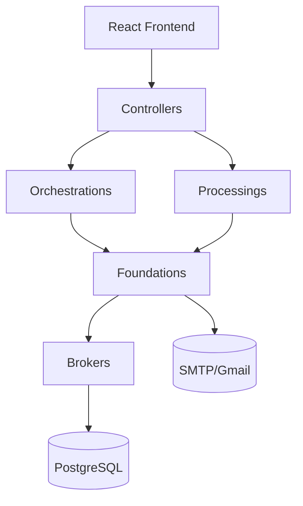
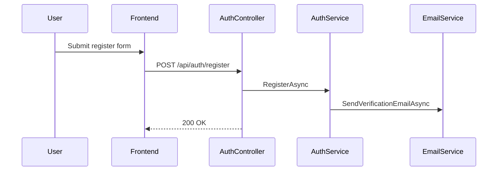

# Diagrams

## Layered components

```mermaid
flowchart TD
  Client[React Frontend] --> Controllers
  Controllers --> Orchestrations
  Controllers --> Processings
  Orchestrations --> Foundations
  Processings --> Foundations
  Foundations --> Brokers
  Brokers --> PostgreSQL[(PostgreSQL)]
  Foundations --> SMTP[(SMTP/Gmail)]
```

## Authentication flow

```mermaid
sequenceDiagram
  participant U as User
  participant FE as Frontend
  participant API as AuthController
  participant S as AuthService
  participant E as EmailService

  U->>FE: Submit register form
  FE->>API: POST /api/auth/register
  API->>S: RegisterAsync
  S->>E: SendVerificationEmailAsync
  API-->>FE: 200 OK
```
